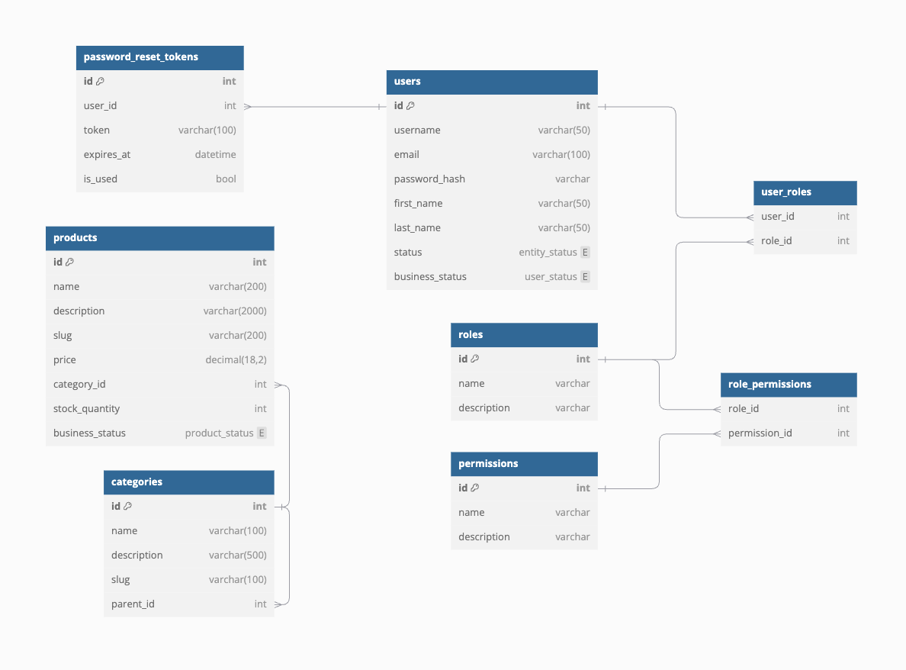

# JoyGame Case Study - E-commerce API

A robust ASP.NET Core 9.0 API for a gaming-focused e-commerce platform, featuring product catalog management, user authentication, and role-based access control.

## Features

- 🔐 JWT Authentication & Authorization
- 🎮 Product/Category Management with Hierarchical Categories
- 📦 SQL Server Database with EF Core Migrations
- 🐳 Dockerized SQL Server Instance
- 📈 Paginated Product Search with Stored Procedures
- 🔄 CQRS-like Repository Pattern
- ✅ xUnit Integration Tests
- 🛡️ Password Reset Workflow
- 📊 Seeded Demo Data (Products/Categories/Users)

## Technologies

- .NET 9.0
- Entity Framework Core 9
- SQL Server (Azure SQL Edge in Docker)
- xUnit + Coverlet
- JWT Authentication
- Docker + Docker Compose
- ASP.NET Core Middleware
- Repository Pattern + Unit of Work

## Getting Started

### Prerequisites

- .NET 9.0 SDK
- Docker Desktop
- SQL Client (SSMS, Azure Data Studio, etc.)
- IDE (VS 2022, VS Code, or Rider)

### Installation

1. Clone the repository:
```bash
git clone https://github.com/yourusername/joygame-case-study.git
cd joygame-case-study
```

2. Restore dependencies:
```bash
dotnet restore
```

### Configuration

1. Update connection strings in:
   - `src/JoyGame.CaseStudy.API/appsettings.json`
   - `src/JoyGame.CaseStudy.Persistence/appsettings.json`

2. Docker setup (in docker-compose.yml):
```yaml
environment:
  - "MSSQL_SA_PASSWORD=SU2orange!" # Change this for production!
```

### Running the Application

1. Start dependencies:
```bash
docker-compose up -d
```

2. Run the API:
```bash
cd src/JoyGame.CaseStudy.API
dotnet run
```

3. The API will be available at:
```
https://localhost:7018/swagger
```

## API Documentation

### Key Endpoints

| Endpoint                | Method | Description                     |
|-------------------------|--------|---------------------------------|
| /api/auth/login         | POST   | JWT Authentication             |
| /api/products           | GET    | Paginated product search       |
| /api/categories/tree    | GET    | Hierarchical category structure|
| /api/users              | POST   | Create new user                |

### Authentication
```http
POST /api/auth/login
Content-Type: application/json

{
  "username": "admin",
  "password": "Admin123!"
}
```

## Testing

Run the test suite with:
```bash
dotnet test
```

## Docker Setup

The solution includes:
- SQL Server 2022 Edge
- Automatic database seeding
- Migration handling

Services:
```yaml
services:
  mssql:
    image: mcr.microsoft.com/azure-sql-edge:latest
    ports:
      - "1433:1433"
    environment:
      - "ACCEPT_EULA=1"
      - "MSSQL_SA_PASSWORD=SU2orange!"
```

## Database Schema



## Seeded Data

Initial data includes:
- 150+ Gaming Products
- 4 Main Categories with Subcategories
- Admin User: `admin/Admin123!`
- Regular User: `user/User123!`

## Contributing

1. Fork the repository
2. Create your feature branch
3. Commit your changes
4. Push to the branch
5. Open a Pull Request

## License

MIT License - see [LICENSE](LICENSE) file